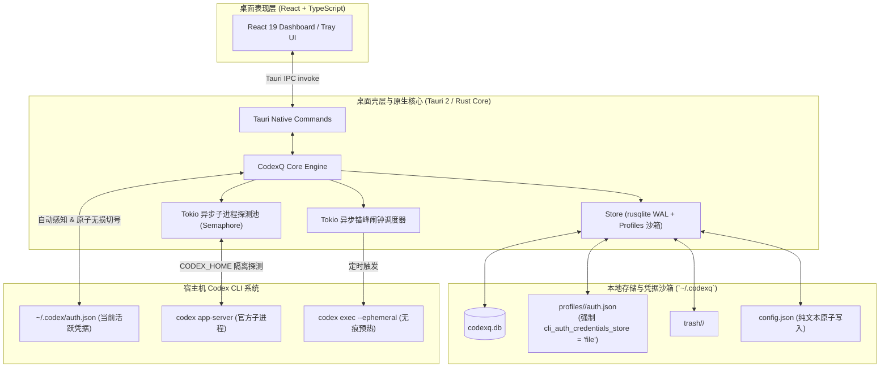

# CodexQ 系统架构与技术实现 (architecture.md)

本文档是 CodexQ 项目的权威架构与实现规范（Current Truth）。

---

## 1. 整体架构与数据流

CodexQ 桌面端采用现代化 **纯 Tauri 2 (Rust 原生核心 + React 表现层)** 架构，实现了进程内零 RPC 开销、零外部环境依赖的独立单二进制应用；底层与 **Codex CLI 子系统** 协同运作：



---

## 2. 存储规范与数据模型

默认工作与存储目录位于 `~/.codexq/`，整体目录物理结构如下：

```text
~/.codexq/
├── config.json               # 全局用户配置（纯文本 JSON，2 空格缩进，直接手写可读可编辑）
├── codexq.db                 # SQLite 数据库（启用 WAL 模式与外键约束，存储账号、额度快照与闹钟）
├── profiles/                 # 各账号的物理隔离沙箱
│   └── <profile-id>/         # 账号 profile_id（基于 identity_key 计算的 SHA256 前 20 位）
│       ├── auth.json         # 账号独立的凭据镜像（chmod 0600）
│       └── config.toml       # 配置文件（强制声明 cli_auth_credentials_store = "file"）
└── trash/                    # 回收站隔离目录
    └── <profile-id>/
```

### 2.1 SQLite Schema 定义

`codexq.db` 包含五张核心数据表（账号、最新额度、快照历史、回收站、闹钟）：

```sql
-- 1. 账号主表
CREATE TABLE IF NOT EXISTS accounts (
    identity_key TEXT PRIMARY KEY,          -- 唯一主键: f"{user_id}\x1f{account_id}"
    profile_id TEXT NOT NULL UNIQUE,        -- 20位 hex profile 目录名
    user_id TEXT NOT NULL,                  -- chatgpt_user_id
    account_id TEXT NOT NULL,               -- chatgpt_account_id
    email TEXT,                             -- 邮箱（从 id_token 解码）
    plan TEXT,                              -- 订阅类型 (free / plus / team / pro 等)
    alias TEXT,                             -- 用户自定义别名
    org_title TEXT,                         -- 机构/工作空间标题
    first_seen_at TEXT NOT NULL,            -- 首次收纳时间 (ISO 8601 UTC)
    last_seen_at TEXT NOT NULL,             -- 最近活动时间 (ISO 8601 UTC)
    last_credential_update TEXT NOT NULL,   -- 凭据最后变动时间
    credential_sha256 TEXT NOT NULL,        -- auth.json 内容哈希
    credential_path TEXT NOT NULL,          -- 本地 profile 凭据绝对路径
    credential_status TEXT NOT NULL DEFAULT 'active', -- active / expired / error
    reset_credits INTEGER DEFAULT 0,        -- 可用重置机会
    last_error TEXT,                        -- 最近探测异常信息
    UNIQUE(user_id, account_id)
);

-- 2. 最新额度状态表
CREATE TABLE IF NOT EXISTS quota_latest (
    identity_key TEXT NOT NULL,             -- 关联 accounts
    limit_id TEXT NOT NULL,                 -- 额度规则 ID (如 "codex")
    fetched_at TEXT NOT NULL,               -- 刷新时间
    primary_used_percent REAL,              -- 主周期已用百分比 (0.0 ~ 100.0)
    primary_window_minutes INTEGER,         -- 主周期窗口时长 (如 300 分钟 = 5H)
    primary_resets_at INTEGER,              -- 主周期重置时间戳 (Unix Epoch)
    secondary_used_percent REAL,            -- 次周期已用百分比 (如 10080 分钟 = 7天)
    secondary_window_minutes INTEGER,       -- 次周期窗口时长
    secondary_resets_at INTEGER,            -- 次周期重置时间戳
    raw_json TEXT NOT NULL,                 -- app-server 原始返回快照
    PRIMARY KEY(identity_key, limit_id),
    FOREIGN KEY(identity_key) REFERENCES accounts(identity_key) ON DELETE CASCADE
);

-- 3. 额度历史快照表 (时间序列)
CREATE TABLE IF NOT EXISTS quota_snapshots (
    id INTEGER PRIMARY KEY AUTOINCREMENT,
    identity_key TEXT NOT NULL,
    limit_id TEXT NOT NULL,
    observed_at TEXT NOT NULL,              -- 观测时间 (ISO 8601 UTC)
    primary_used_percent REAL,
    primary_window_minutes INTEGER,
    primary_resets_at INTEGER,
    secondary_used_percent REAL,
    secondary_window_minutes INTEGER,
    secondary_resets_at INTEGER,
    raw_json TEXT NOT NULL,
    FOREIGN KEY(identity_key) REFERENCES accounts(identity_key) ON DELETE CASCADE
);
CREATE INDEX IF NOT EXISTS idx_quota_snapshots_identity_time
    ON quota_snapshots(identity_key, observed_at);

-- 4. 软删除回收站记录表
CREATE TABLE IF NOT EXISTS removed_accounts (
    identity_key TEXT PRIMARY KEY,
    profile_id TEXT NOT NULL,
    email TEXT,
    user_id TEXT,
    plan TEXT,
    display_name TEXT,
    removed_at TEXT NOT NULL
);

-- 5. 账号独立定时预热/触发闹钟表
CREATE TABLE IF NOT EXISTS account_alarms (
    id TEXT PRIMARY KEY,                    -- 闹钟唯一标识 (如 "alm_1726123456")
    identity_key TEXT NOT NULL,             -- 关联 accounts 表
    time_of_day TEXT NOT NULL,              -- 触发时间点 "HH:MM" (如 "08:00")
    days_of_week TEXT NOT NULL DEFAULT '1,2,3,4,5', -- 重复周期/模式 ("1,2,3,4,5" 为工作日, "1,2,3,4,5,6,7" 为每天, "once" 为仅一次)
    enabled INTEGER NOT NULL DEFAULT 1,     -- 开关: 1 启用, 0 禁用 (一次性闹钟触发后自动置为 0)
    model_override TEXT,                    -- 专用模型覆盖 (为空则继承全局 warmup.default_model)
    prompt_override TEXT,                   -- 专用提示词覆盖 (为空则继承全局 warmup.prompt)
    last_triggered_at TEXT,                 -- 上次触发时间 (ISO 8601 UTC)
    last_status TEXT,                       -- 上次状态: success / failed / skipped
    created_at TEXT NOT NULL,               -- 创建时间 (ISO 8601 UTC)
    FOREIGN KEY(identity_key) REFERENCES accounts(identity_key) ON DELETE CASCADE
);
CREATE INDEX IF NOT EXISTS idx_account_alarms_identity
    ON account_alarms(identity_key);
```

### 2.2 全局配置文件规范 (`~/.codexq/config.json`)

为保持配置的高透明度与可维护性，CodexQ 将全局静态设置从数据库中剥离，集中存储于纯文本 JSON 文件 `~/.codexq/config.json`：

- **单源真实与原子写入**：所有配置写入均通过“临时文件写盘 + `os.fsync` 刷盘 + `os.replace` 原子覆写”完成，防止断电或并发写损坏。
- **纯文本与手写友好**：格式化为 2 空格缩进，用户可直接使用 VS Code、记事本等工具直接查阅与编辑，开箱即懂。
- **配置结构标准定义**：

```json
{
  "version": 1,
  "trigger": {
    "default_model": "gpt-5.6-luna",
    "preset_models": [
      "gpt-5.6-luna",
      "gpt-5.2-preview",
      "gpt-5",
      "gpt-5.1"
    ],
    "prompt": "hi",
    "skip_if_active": true
  },
  "auto_refresh": {
    "enabled": false,
    "interval_minutes": 15,
    "on_startup": true,
    "notify": false,
    "dynamic_reset_enabled": true,
    "notify_on_quota_restored": true
  }
}
```

---

## 3. Profile 沙箱隔离与 Token 安全生命周期

### 3.1 凭据隔离机制
官方 Codex CLI 在默认配置下可能会使用系统的 Keyring / Credential Manager 存储 Token。为了实现完全可控、无冲突的多账号隔离：
- 每个账号拥有专属目录：`~/.codexq/profiles/<profile-id>/`。
- 在每个 profile 目录下初始化 `config.toml`：
  ```toml
  cli_auth_credentials_store = "file"
  ```
- 当以该 profile 查询额度时，指定环境变量 `CODEX_HOME=<profile-dir>`。因此 `codex app-server` 会将自动刷新后的 OAuth Token 写回到该 profile 的 `auth.json`，不影响外部系统。

### 3.2 切号防丢保护流程 (`switch`)
切号操作涉及真实的 `~/.codex/auth.json` 替换，核心逻辑实施**原子保障**：
1. **预检与归档**：检查当前宿主机 `~/.codex/auth.json`。若存在有效登录，计算其最新 Token 哈希，原位同步写回对应账号的 `profiles/<current-profile-id>/auth.json`，确保运行期间刷新的最新 access/refresh token 不被截断遗失。
2. **目标账号主动自愈**：切换前检测目标账号的 `access_token` 有效期；若已过期或即将到期（< 5分钟），自动调用 OAuth 续期协议换取新 Token 并写回目标 Profile，确保切号即用，避免切号后处于 401 故障态。
3. **原子覆写**：从目标账号的 profile 目录读取最新 `auth.json`，通过原子写入临时文件并重命名的方式更新 `~/.codex/auth.json`。
4. **状态标记**：更新数据库中的 `last_seen_at` 记录。
5. **解耦原则**：切号操作仅负责凭据的原子覆写与状态同步，不再强制触发外部进程重启，避免打扰用户当前工作流。

### 3.3 OAuth Token 自动续期协议 (RTR Auto-Renewal)
OpenAI 官方客户端采用 **Refresh Token Rotation (RTR)** 机制维护认证生命周期：
- **认证端点**：主端点 `https://auth.openai.com/oauth/token`（备用容灾端点 `https://auth0.openai.com/oauth/token`）。
- **客户端凭证标识**：`client_id: "app_EMoamEEZ73f0CkXaXp7hrann"`（从官方 JWT `id_token` 的 `aud` 或 `access_token` 的 `client_id` 声明动态解析，保证向前兼容）。
- **换票请求格式**：
  ```json
  {
    "client_id": "app_EMoamEEZ73f0CkXaXp7hrann",
    "grant_type": "refresh_token",
    "refresh_token": "<refresh_token>"
  }
  ```
- **双重触发机制 (Proactive & Reactive)**：
  1. **主动预测续期 (Proactive Renewal)**：在进行额度探测、定时预热触发或账号切换前，解码 `tokens.access_token` JWT 载荷中的 `exp` 声明。若当前时间距离过期不足 5 分钟，自动静默触发换票更新。
  2. **响应式自愈重试 (Reactive Fallback)**：若 `codex app-server` 的 `account/rateLimits/read` 接口返回 401 Unauthorized / Token Expired 异常，拦截器自动捕获并执行换票；换票成功后立即自动重试一次额度探测，实现无感自愈。
- **原子凭证落盘**：换票成功后，OpenAI 返回全新的 `access_token` 与轮换后的 `refresh_token`。CodexQ 立即更新 Profile `auth.json` 与 `last_refresh` 时间戳，原子重命名替换文件；更新 SQLite 中的 SHA256 与有效状态；若该账号处于激活态，同步原子刷新宿主 `~/.codex/auth.json`。

### 3.4 历史备份智能吸纳机制 (Bi-directional Backup Sync)
官方 Codex CLI 在登录或认证变动时会在 `~/.codex/backups/<timestamp>/auth.json` 留存凭据快照：
- **无损吸收原则**：扫描全量备份目录，根据 `chatgpt_user_id` 与 `account_id` 分组识别候选凭证。
- **时间序与内容防降级**：
  1. 候选凭证之间比对 `last_refresh` ISO 时间戳（若缺失则回退至 JWT `exp` 声明），仅保留最新的候选备份。
  2. 候选凭证与本地现有 Profile 比对：通过 `is_auth_newer_or_equal(candidate, existing)` 严格阻断旧凭证覆盖新凭证。
- **状态重激活**：当检测到备份中有更新的凭证且 SHA256 发生改变时，自动将凭证同步吸纳至 Profile，并把数据库中的 `credential_status` 重新拉回 `active`、清空 `last_error`。
- **用户显式删除保护**：被用户显式移入回收站 (`removed_accounts`) 的账号被严格忽略，防止因扫描历史备份而意外复活。

---

## 4. 通信契约与指令层

### 4.1 GUI 前端与 Rust 原生核心交互：Tauri Native Commands (In-Process IPC)
- **传输模式**：前端 React 通过 `@tauri-apps/api/core` 的 `invoke` 与 Rust 进程直接通信，**零跨进程 JSON-RPC 管道延迟，零端口占用，零 Python 运行时依赖**。
- **支持的核心 Tauri Commands**：
  - `list_accounts`: 获取全量账号列表与最新额度。
  - `refresh_all(concurrency: Option<u32>)`: 触发多账号并发刷新（基于 Tokio 信号量控制并发池）。
  - `switch_account(target: String, restart: Option<bool>)`: 切换当前账号凭据（默认 `restart=false`，切号不触发重启）。
  - `restart_codex(relaunch: Option<bool>, start_if_not_running: Option<bool>)`: 重启外部 Codex 宿主进程；若未运行且 `start_if_not_running=true`（默认），则直接拉起启动 Codex 桌面端。
  - `set_alias(target: String, alias: Option<String>)`: 更新别名。
  - `reset_all_aliases()`: 重置所有别名。
  - `get_history(target: String, limit: Option<u32>)`: 查询账号额度快照历史。
  - `remove_account(target: String)`: 软删除移入回收站。
  - `list_trash()`: 查看回收站列表。
  - `restore_account(target: String)`: 从回收站恢复。
  - `purge_trash(target: Option<String>)`: 物理彻底清理。
  - `get_app_settings()`: 获取全局偏好配置字典。
  - `set_app_setting(key: String, value: String)`: 写入全局配置项。
  - `list_account_alarms(target: Option<String>)`: 获取指定账号或全量账号的预热闹钟列表。
  - `save_account_alarm(alarm: Value)`: 新增或更新账号预热闹钟（强校验 5 小时非重合约束）。
  - `delete_account_alarm(id: String)`: 删除指定闹钟。
  - `trigger_warmup(target, model, prompt, force, timeout)`: 立即触发单次预热问候请求。
  - `set_locale(locale: String)`: 动态重绘系统原生托盘菜单语言。

### 4.2 Rust 核心与 Codex CLI 交互：`codex app-server`
- Rust 通过 `tokio::process::Command` 启动后台子进程 `codex app-server --stdio`（Windows 平台启用 `CREATE_NO_WINDOW` 0 弹窗闪烁）。
- 通过 stdio JSON-RPC 发送握手指令（`initialize` -> `initialized` -> `account/rateLimits/read`）并监听响应，提取限额窗口 (`window_minutes`)、已使用比率 (`used_percent`) 和重置时间 (`resets_at`)。

---

## 5. 客户端额度调度策略与生命周期 (Client Quota Scheduling & Lifecycle)

为了兼顾数据的实时性、系统的低功耗以及对 OpenAI 官方接口的访问合规性，客户端采用**混合事件调度模型（Hybrid Quota Scheduling）**：

```text
                     ┌──────────────────────────────────────┐
                     │ 刷新事件发生 (手动 / 启动 / 周期 / JIT) │
                     └──────────────────┬───────────────────┘
                                        │
                                        ▼
                   ┌──────────────────────────────────────────┐
                   │ 更新 lastRefreshedTime = Date.now()       │
                   │ (周期轮询定时器自动顺延一个完整周期)       │
                   └────────────────────┬─────────────────────┘
                                        │
                                        ▼
                   ┌──────────────────────────────────────────┐
                   │ 取消并销毁旧的 JIT 到期 Timer (clearTimeout)│
                   └────────────────────┬─────────────────────┘
                                        │
                                        ▼
                   ┌──────────────────────────────────────────┐
                   │ 额度状态比对：检测是否有账号从耗尽恢复满血 │
                   │ (若开启 notifyOnQuotaRestored 则发系统通知)│
                   └────────────────────┬─────────────────────┘
                                        │
                                        ▼
                   ┌──────────────────────────────────────────┐
                   │ 扫描非满血账号，获取全池【下一个最早到期时间 T】│
                   │ 若存在，仅注册 1 个 JIT Timer 于 T + 10s   │
                   └──────────────────────────────────────────┘
```

### 5.1 三阶混合刷新机制
1. **冷启动立即刷新 (Startup Refresh)**：
   - 应用启动先呈现 SQLite 本地秒级快照，随后后台发起冷启动刷新，保证初始数据新鲜度。
2. **常规周期轮询 (Periodic Polling)**：
   - 用户可配置 5m/10m/15m/30m/60m 或自定义周期，作为长效背景保底更新。
3. **JIT 到期动态自感知刷新 (Just-In-Time Reset Refresh)**：
   - 提取各账号返回的 `primary.resets_at`（5小时主周期）和 `secondary.resets_at`（周次周期）。
   - 仅针对当前有额度消耗（`used_percent > 0`）且未过期的账号进行到期监听。
   - 设定在最早到期时间点后的 **10 秒缓冲期**（`resets_at + 10s`）准时触发，彻底吸收官方服务器时钟微差与结算延迟。

### 5.2 定时器清空与防竞态重置 (Timer Invalidation & Cancellation)
- **绝对单源时间戳**：任何刷新完成时，全局基准时间戳更新为当前时间，阻止周期定时器短时间内重复跑。
- **旧定时器完全注销**：每一次刷新后，彻底清除上一轮挂载的 `setTimeout`，根据最新拉回的精确重置时间重新计算全池唯一的最早唤醒时刻。
- **并发互斥锁**：`refreshingRef` 保证任何时刻全局仅有 1 个并发探测任务执行。

### 5.3 满血复活感知与系统桌面通知分级
- **状态差分计算**：对比刷新前后的快照。当账号由“不可用/耗尽（可用额度 0% 或已用 ≥ 90%）”跃迁为“可用/满血（已用清零或大幅恢复）”时，识别为**满血复活事件**。
- **独立设置开关**：
  - `dynamicResetEnabled`: 是否启用 JIT 动态到期唤醒（默认开启）；
  - `notifyOnQuotaRestored`: 是否在满血复活时弹出 Windows 原生系统桌面通知（可配置）；
  - `notifyOnUpdate`: 是否在常规自动刷新后弹出界面 Toast（默认关闭，保持纯静默）。

---

## 6. 定时预热与多闹钟错峰流水线机制 (Scheduled Warmup & Staggered Pipeline)

为了解决开发者 10:00 上班与 5 小时滑动额度窗口错位导致的午后断粮问题，CodexQ 引入了基于纯标准库实现的无痕垫刀与流水线调度体系：

### 6.1 垫刀执行协议 (Execution Protocol)
- **执行方式**：在指定账号 Profile 沙箱下调用官方无头子进程：
  ```bash
  CODEX_HOME="~/.codexq/profiles/<profile_id>" codex exec --ephemeral --skip-git-repo-check -m "<model>" "<prompt>"
  ```
  - `--ephemeral`：不落地会话文件，不污染用户工作区的历史对话树。
  - `--skip-git-repo-check`：允许在任意非 Git 目录下秒级启动执行。
  - `-m <model>`：指定问候模型，默认使用 `gpt-5.6-luna`。
- **防浪费幂等校验（Skip-if-Active）**：
  - 触发预热前先从 SQLite 读取该账号的最新配额；
  - 若检测到当前配额处于活跃且未到期状态（`used_percent > 0` 且 `primary_resets_at > now`），自动跳过本次预热，避免多余 token 消耗。

### 6.2 多闹钟防重叠约束（Non-overlapping Constraint）
- 允许单账号配置多个排期闹钟（如工作日 08:00、13:30）；
- **5 小时安全约束校验**：任何两个启用闹钟之间的时间间隔必须满足 $\Delta t \ge 5\text{ 小时}$（即 300 分钟），在保存和配置时由引擎与前端协同强校验拦截，防止同账号短时间内重复触发导致窗口空耗。

### 6.3 动态常用推荐模型标签管理
- 全局默认模型支持任意文本输入（默认为 `gpt-5.6-luna`）；
- 维护可动态编辑的常用预设数组（序列化为 JSON 存入 `config.json` 的 `trigger.preset_models` 键）；
- 前端支持一键选取、动态新增预设标签和删除已有预设标签。

### 6.4 「仅一次」排期模式与生命周期自闭机制 (One-time Alarm Lifecycle)
- **重复模式扩展**：排期闹钟支持「仅一次」(`once`)、「工作日」(`1,2,3,4,5`) 和「每天」(`1,2,3,4,5,6,7`)。
- **生命周期自闭**：对于 `once` 模式的闹钟，在到达设定时间触发完成后（无论成功执行还是跳过），调度器自动将该闹钟的开关置为停用（`enabled = 0`），保留历史执行记录且不破坏数据，用户后续需要时可再次手动开启。
- **后台常驻轮询调度器**：
  - **桌面端 (Rust Core)**：在应用启动时由 `src-tauri/src/core/scheduler.rs` 挂载 Tokio 异步后台任务，每 15 秒轮询检查一次满足时钟触发条件的激活闹钟，并具备 75 秒防同分钟重复触发保护；
  - **Python 伴侣端 (`codexq.py`)**：在 stdio JSON-RPC 守护进程中挂载 `alarm_scheduler` 异步协程，保持一致的调度语义。

---

## 7. 国际化与双语架构设计 (Internationalization & i18n Architecture)

CodexQ 采用工业级多语言分层架构：**英文基线兜底、前端驱动自然语言、后端声明结构化语义**。

### 7.1 全局语言配置真理源 (`~/.codexq/config.json`)
在配置文件根节点维护 `general.locale`：
```json
{
  "$schema_version": 1,
  "general": {
    "locale": "auto"
  },
  "auto_refresh": { ... },
  "trigger": { ... }
}
```
- `"auto"`（默认）：启动时自适应检测宿主操作系统或浏览器语言环境；若为中文则加载 `zh-CN`，其他统一进入默认英文 `en-US`。
- `"en-US"`：强制全系统英文。
- `"zh-CN"`：强制全系统简体中文。

### 7.2 前端 UI 层 (React 19 + `i18next`)
- **基线兜底 (`fallbackLng: "en-US"`)**：任何缺失或未翻译的 Key 自动回退至标准英文，保证 UI 不留白、不泄露原始键名。
- **语言包物理分布**：
  - `src/locales/en-US.json`：全量英文标准字典（Source of Truth）。
  - `src/locales/zh-CN.json`：简体中文资源包。
- **即时响应式热切换**：用户在【设置与关于】切换语言后，React 组件树无需重载页面即可实时重绘；并联动持久化至 `config.json`。

### 7.3 系统壳层 (Tauri 2 / Rust)
- **托盘菜单 (System Tray)**：定义 `Locale` 枚举映射双语菜单文本（"Show Dashboard" / "显示主窗口"、"Refresh All" / "刷新配额"、"Quit" / "退出"）。
- **动态重绘**：前端切换语言时调用 `set_locale` 命令，Rust 端就地调用 `tray.set_menu(...)` 完成托盘毫秒级无感热切换。
- **原生通知**：前端调用通知插件时已传入本地化文本；Rust 内部日志与系统级严重异常默认输出英文。

### 7.4 核心引擎层 (Python Core `codexq.py`)
- **零依赖守则**：严禁引入第三方 gettext 或 Babel 编译依赖，维持单文件免安装即用。
- **RPC 机器码解耦**：
  ```python
  # RPC 返回标准化结构
  {
      "success": True,
      "status": "skipped",
      "code": "WINDOW_ALREADY_ACTIVE",
      "params": {"resets_at": "19:40"},
      "message": "Quota window is already active (resets at 19:40). Skipped."
  }
  ```
  前端优先按 `code` 查本地语言包渲染；未匹配时优雅降级展示英文 `message`。
- **CLI 终端输出**：默认输出英文对齐官方 Codex CLI；可选读取 `config.json` 针对终端表格和提示进行轻量字典映射。
